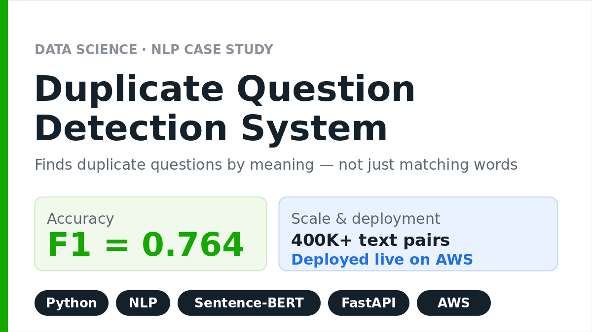
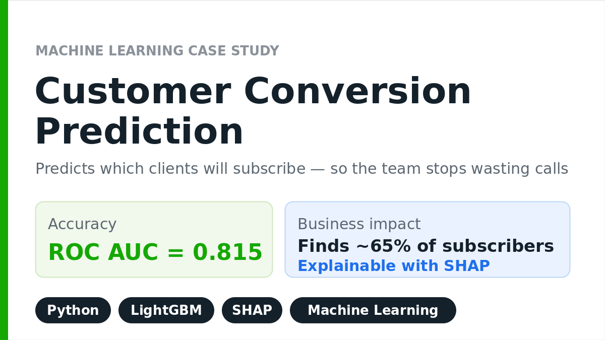
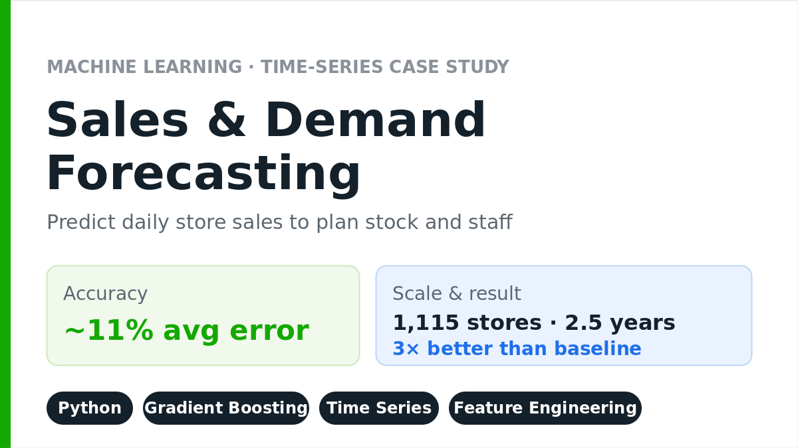
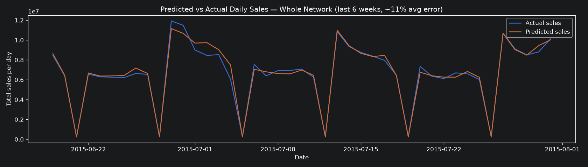

# Daryna Zelenska — Data Science & Machine Learning Portfolio

**Data Scientist · Machine Learning Engineer · AI Engineer**

I help businesses turn raw, messy data into production-grade machine learning models, predictive analytics, and AI / LLM solutions that create real value — not notebooks that sit unused. Below are hands-on case studies, each solving a concrete business problem, with code, metrics, and (where possible) a live demo.

<!-- Tech stack badges (render automatically on GitHub) -->

---

## 👩‍💻 About me

I am a Data Scientist and Machine Learning Engineer working in Python across classic machine learning, deep learning, NLP, and modern LLM / RAG systems. I build the full workflow — from data cleaning and exploratory analysis to model training, evaluation, and deployment to production — and I explain results in plain language so non-technical stakeholders can act on them.

- 🧰 **Core stack:** Python, pandas, NumPy, scikit-learn, PyTorch, LightGBM, SQL, FastAPI, Docker, AWS
- 🤖 **AI / LLM:** OpenAI & Anthropic Claude APIs, LangChain, RAG, vector databases
- 📊 **Focus:** predictive analytics, NLP, forecasting, and explainable machine learning

---

## 📑 Table of contents

- [Case Study 1 — Duplicate Question Detection (NLP)](#-case-study-1--duplicate-question-detection-nlp)
- [Case Study 2 — Customer Conversion Prediction (Machine Learning)](#-case-study-2--customer-conversion-prediction-machine-learning)
- [Case Study 3 — Sales & Demand Forecasting (Time Series)](#-case-study-3--sales--demand-forecasting-time-series)
- [More case studies (in progress)](#-more-case-studies-in-progress)
- [Tech stack](#-tech-stack)
- [Contact](#-contact)

---

## 📊 Results at a glance

| Case study | Problem | Result | Stack |
|---|---|---|---|
| Duplicate Question Detection | Find duplicate questions at scale | **F1 = 0.764** (+7.5% vs baseline), deployed on AWS | Python, NLP, Sentence-BERT, FastAPI |
| Customer Conversion Prediction | Stop wasting sales calls | **ROC AUC = 0.815**, finds ~65% of subscribers | Python, LightGBM, SHAP |
| Sales & Demand Forecasting | Plan store stock & staffing | **~11% error (MAPE 10.7%)**, 3× better than baseline | Python, Gradient Boosting, time series |

---

## 🔍 Case Study 1 — Duplicate Question Detection (NLP)

<!-- Обкладинка: поклади cover1_Duplicate_Detection.png у корінь репозиторію (поряд із README.md) -->

**Why:** A platform with hundreds of thousands of user questions had the same question asked over and over in different words. Moderators spent hours finding duplicates by hand, and it did not scale.

**How:** I built a system that compares the *meaning* of two questions, not just matching words. It combines AI text embeddings (Sentence-BERT) with classic TF-IDF and lexical features in Python; I tested several machine learning approaches and kept the best one. I deployed it on AWS as a ready-to-use service — a Streamlit web app plus a FastAPI REST API — with automated tests (pytest).

**Result:** Duplicate checks now take **seconds instead of hours**. Accuracy **F1 = 0.764 (+7.5% over the TF-IDF baseline)**, LogLoss 0.3875. Every prediction returns a confidence score, and the API can plug into any platform.

<!-- Додай реальні скріншоти демки (поклади в корінь репо і розкоментуй) -->
<!--  -->

**Tech:** Python · Sentence-Transformers · scikit-learn · FastAPI · Streamlit · AWS EC2 · pytest
**Data:** open Quora Question Pairs dataset (400K+ pairs)

🔗 [Case details](./duplicate-detection-case) · [Code](https://github.com/darinaze) · *(add: live demo link)*

---

## 🏦 Case Study 2 — Customer Conversion Prediction (Machine Learning)

<!-- Обкладинка: поклади cover2_Conversion_Prediction_v2.png у корінь репозиторію -->

**Why:** A bank's call center was phoning everyone to sell term deposits — but only about **11%** of calls worked. Most of the team's time and budget went on people who were never going to say yes.

**How:** I built a model that scores each client by how likely they are to subscribe, so the team calls the most promising people first. Using data on 41K clients in Python, I ran full exploratory analysis and feature engineering, compared four algorithms (Logistic Regression, kNN, Decision Tree, LightGBM with tuning), and added business rules (e.g. stop calling after 5 attempts). Every prediction is explainable with **SHAP**, so the bank sees *why* each client got their score.

**Result:** The model finds **~65% of real subscribers** and ranks clients by likelihood, cutting wasted calls. Accuracy **ROC AUC = 0.815** (best of 4 algorithms); F1 improved 0.50 → 0.53 after business rules.

<!--  -->

**Tech:** Python · scikit-learn · LightGBM · Hyperopt · SHAP · pandas · Seaborn
**Data:** open UCI Bank Marketing dataset (41K clients)

🔗 [Case details](./bank-marketing-case) · [Code](https://github.com/darinaze)

---

## 📈 Case Study 3 — Sales & Demand Forecasting (Time Series)

**Why:** Retailers must decide how much stock to order for every store. Order too much → money wasted on unsold goods; order too little → empty shelves and lost sales. They need an accurate daily sales forecast to plan inventory and staffing.

**How:** Using 2.5 years of daily sales across 1,115 stores, I built the full pipeline in Python — cleaning, EDA, feature engineering (date parts, promotions, per-store demand level and promo sensitivity), and a **time-based** train/validation split (no peeking into the future). I compared models from a simple baseline up to gradient boosting with a log-transformed target.

**Result:** The final model forecasts daily store sales with **~11% average error (MAPE 10.7%) — about 3× better than the baseline (33.5%)**. At the network level, the forecast tracks actual sales almost exactly.

**Tech:** Python · scikit-learn (Gradient Boosting) · pandas · feature engineering · time-series validation
**Data:** open Rossmann Store Sales dataset (~1M records, 1,115 stores)

🔗 [Case details](./sales-forecasting-case) · [Code](https://github.com/darinaze/rossmann-sales-forecasting)

---

## 🚧 More case studies (in progress)

- **Customer Churn Prediction** — flag customers likely to leave, early enough to act. *(Machine Learning, Python, scikit-learn)*
- **AI Assistant over your documents (LLM / RAG)** — answers questions from your files, with sources. *(LLM, LangChain, Python)*

---

## 🧰 Tech stack

**Languages & data:** Python, SQL
**Machine Learning:** scikit-learn, XGBoost, LightGBM, PyTorch, TensorFlow, pandas, NumPy
**NLP & AI / LLM:** Sentence-Transformers, Hugging Face, LangChain, OpenAI & Anthropic Claude APIs, RAG, vector databases
**MLOps & deployment:** FastAPI, Docker, AWS, Git, pytest
**Explainability & viz:** SHAP, Matplotlib, Seaborn

---

## 📫 Contact

- 📧 **Email:** darinazelenska@gmail.com
- 💼 **LinkedIn:** [linkedin.com/in/daryna-zelenska](https://www.linkedin.com/in/daryna-zelenska)
- 🟢 **Upwork:** *(додай посилання на свій профіль)*

> Looking for a Data Scientist / Machine Learning Engineer / AI Engineer who ships accurate, production-ready models? Let's turn your data into a real advantage.
