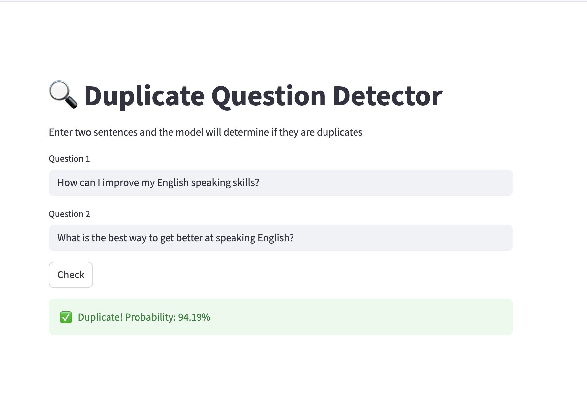
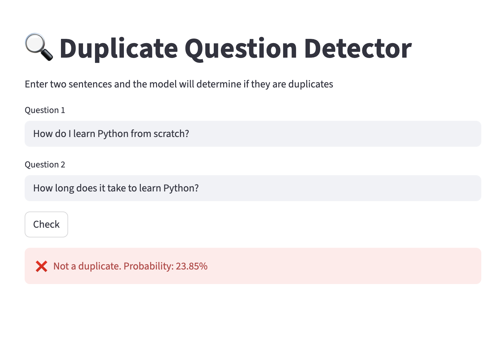

# Duplicate Content Detection System — Semantic Text Matching (NLP)

**F1 = 0.764 · +7.5% vs baseline · Deployed on AWS as a live service**

## 🎯 The Challenge

A platform with hundreds of thousands of user-submitted questions struggles with duplicates — the same question asked in different words. Manual moderation takes hours and doesn't scale.

## ⚙️ The Solution

I analyzed 400K+ question pairs (Quora Question Pairs dataset) and built a model that compares the *meaning* of questions, not just word overlap:

- Semantic embeddings (Sentence-BERT) combined with TF-IDF and lexical features
- Compared multiple approaches to find the optimal one
- Deployed as a ready-to-use service on AWS: REST API + web interface, with automated tests

## 📈 The Result

- Duplicate check takes **seconds instead of hours** of manual review
- The API can be integrated into any platform
- Every prediction comes with a confidence score

## 🔢 Metrics

| Metric | Value |
|---|---|
| F1 Score | 0.764 (+7.5% vs TF-IDF baseline) |
| LogLoss | 0.3875 |
| Deployment | AWS EC2, FastAPI + Streamlit |

## 🖥 Demo

**Duplicate pair detected:**

**Different questions — correctly not flagged:**

## 🛠 Tech Stack

Python · Sentence-Transformers · scikit-learn · FastAPI · Streamlit · AWS EC2 · pytest

---

🔗 **Full technical implementation:** [duplicate-question-detection](https://github.com/darinaze/duplicate-question-detector)

*Built on the open Quora Question Pairs dataset.*
