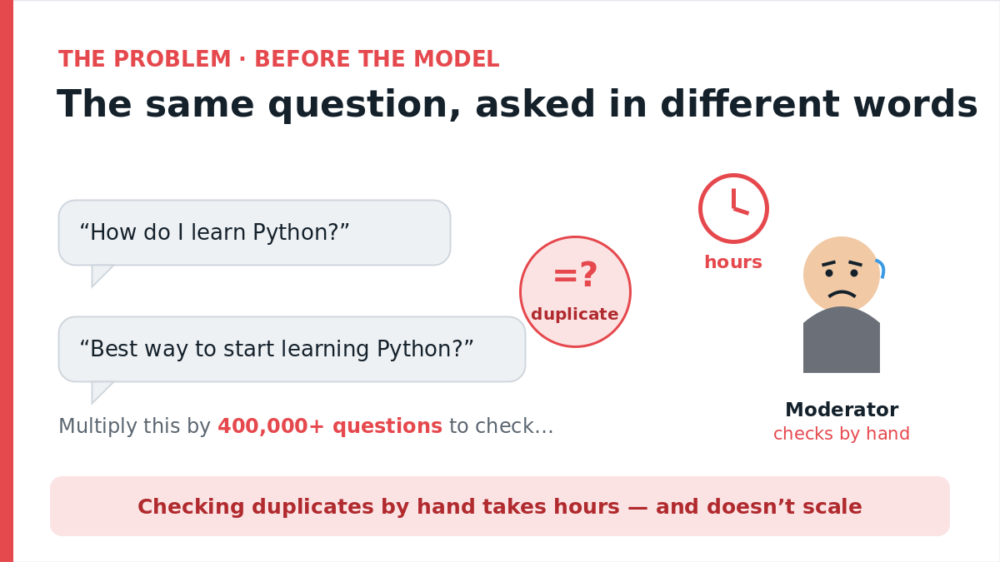
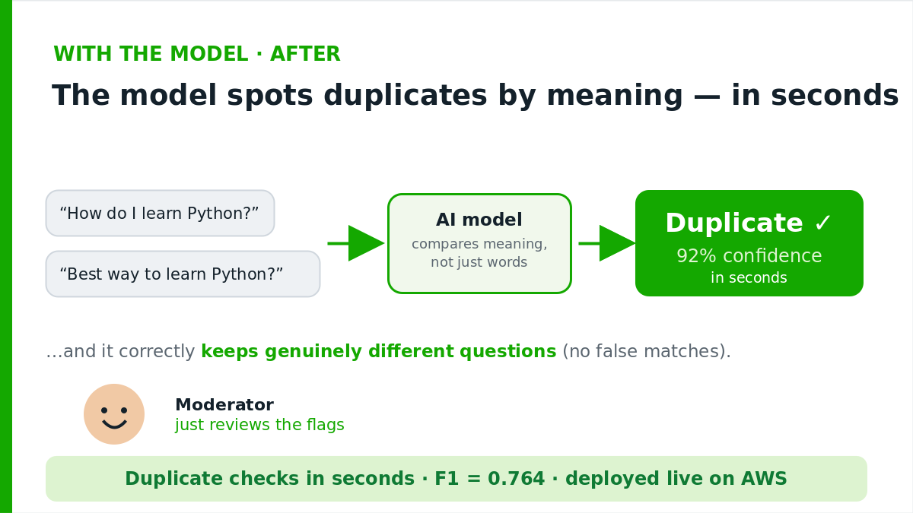
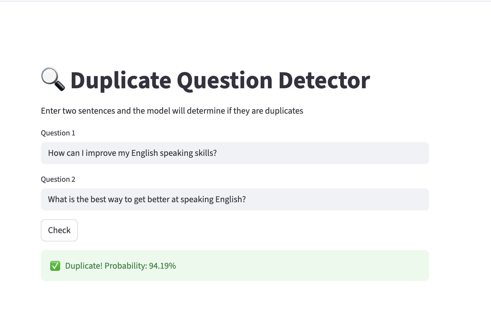
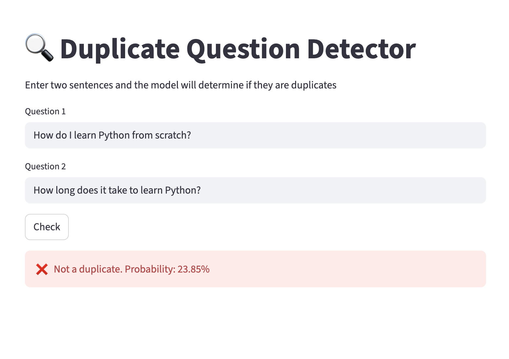

# 🔍 Duplicate Question Detection System (NLP)

> **In one line:** A model that finds duplicate questions by their *meaning* — so a platform stops paying people to spot them by hand.

**F1 = 0.764 (+7.5% vs baseline) · 400K+ text pairs · Deployed live on AWS**

---

## 🎯 The problem (in plain words)

On any big Q&A platform, people ask the **same question in different words** — "How do I learn Python?" and "Best way to start learning Python?" are the same thing. Someone has to catch those duplicates, and doing it **by hand takes hours and does not scale** across hundreds of thousands of questions.

---

## 💡 What I built

I built a system that compares the **meaning** of two questions, not just the words they share. So even when the wording is completely different, it still spots that they are asking the same thing — and it does it in **seconds**, with a confidence score you can trust.

- **Understands meaning, not just keywords.** It uses modern AI text embeddings, so "car" and "automobile" (or two differently-worded questions) are seen as related.
- **Ready to use.** I deployed it as a live service — a web page to test it and an API that plugs into any product.

🔧 Under the hood (for technical readers)

- Analysed **400K+ question pairs** (open Quora Question Pairs dataset).
- Combined **Sentence-BERT** semantic embeddings with **TF-IDF** and lexical features.
- Compared several approaches and kept the best; evaluated with F1 and LogLoss.
- Deployed on **AWS EC2** as a **FastAPI** REST API + **Streamlit** web app, with automated tests (pytest).

---

## 📈 The impact

| What you get | Result |
|---|---|
| Speed | **Seconds instead of hours** of manual review |
| Accuracy | **F1 = 0.764** (+7.5% over the TF-IDF baseline), LogLoss 0.3875 |
| Trust | Every prediction comes with a **confidence score** |
| Easy to plug in | A **REST API** any platform can call |

**Bottom line:** duplicate detection that used to eat hours of moderator time now runs automatically in seconds — accurately, and ready to drop into an existing product.

---

## 🖥 Demo & visuals

**Duplicate pair — correctly detected:**

**Different questions — correctly NOT flagged:**

---

## 🛠 Tech stack

Python · **Sentence-Transformers** · scikit-learn · **FastAPI** · Streamlit · **AWS EC2** · pytest

## 📂 In this repo

- `…` — code (embeddings, model, evaluation)
- `…` — API + Streamlit app
- Data: open **Quora Question Pairs** dataset (400K+ pairs)

🔗 **Full technical implementation:** [duplicate-question-detector](https://github.com/darinaze/duplicate-question-detector) · ⬅️ [Back to portfolio](../README.md)

---

*Built by Daryna Zelenska — Data Scientist · Machine Learning Engineer · NLP. Need to find duplicates, match text, or search by meaning? Let's talk.*
