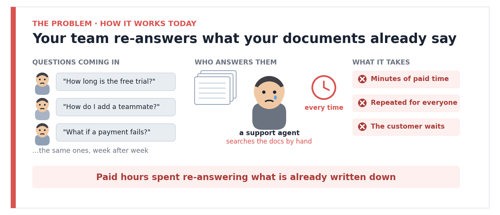
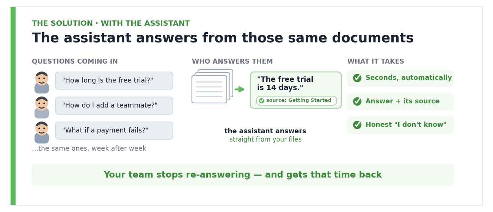
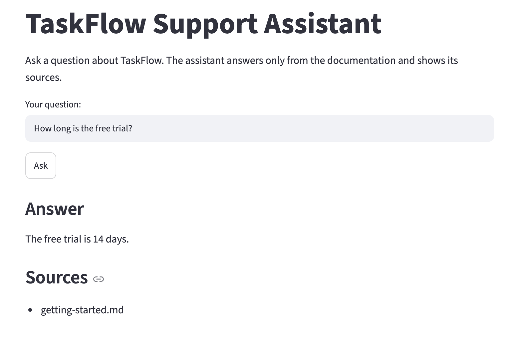
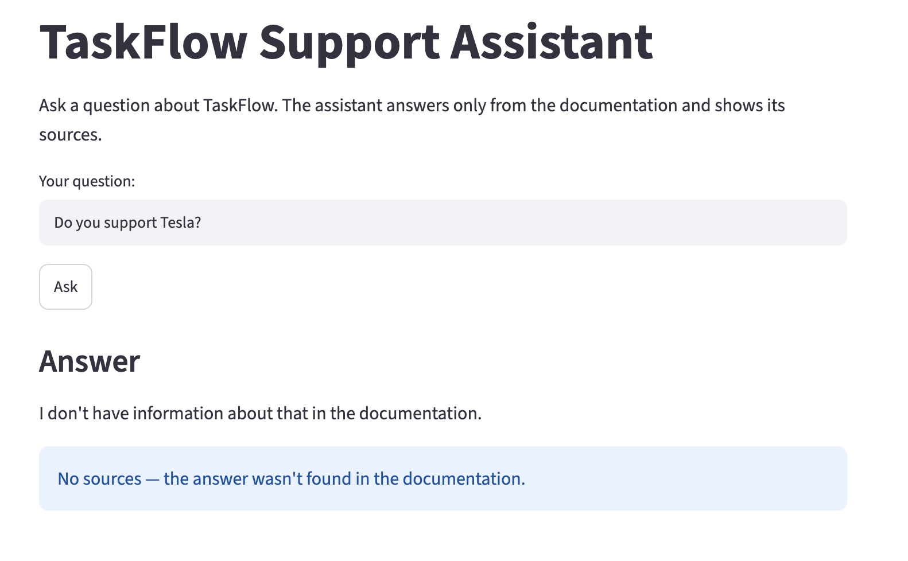

# AI Support Assistant over Documentation — RAG (LLM)

**100% retrieval recall · 100% refusal accuracy on out-of-scope questions · Cites its sources · No LangChain**

## 🎯 The Challenge

Support teams answer the same questions again and again, while the answers already sit in the documentation. Every repeat question costs an agent paid minutes — and the customer waits.

A chatbot built on a raw LLM only moves the problem: it **makes up** answers, which in a support setting is worse than giving no answer at all.

The goal: an assistant that is **grounded in the real documentation, transparent about where each answer comes from, and honest enough to say "I don't know"** when the answer isn't in the docs.

## ⚙️ The Solution

I built a Retrieval-Augmented Generation (RAG) pipeline **from scratch in plain Python** over a knowledge base of 11 documentation articles:

- Split the docs **one chunk per section**, so each chunk stays focused on a single topic and a fact is never cut in half
- Embedded every chunk with a **local** model (`all-MiniLM-L6-v2`) — free, no API cost — and stored it in a **Chroma** vector database
- For each question: retrieve the top-4 most relevant chunks, then let the LLM (`gpt-4o-mini`) answer **only** from that context
- Added a strict guard so the assistant returns a fixed **"I don't know"** instead of inventing an answer
- Filtered the cited sources by a **similarity threshold**, so the assistant shows exactly the document it used — not every chunk that happened to be retrieved
- Built a full evaluation suite (retrieval recall, refusal accuracy, faithfulness and relevancy via an LLM judge) in transparent Python — no black-box framework

## 📈 The Result

- Every answer is **grounded and precisely cited** — the user sees exactly which document it came from
- On out-of-scope questions the assistant **refuses instead of hallucinating** — the single most important property for a customer-facing bot
- **Cost-aware by design**: embeddings run locally for free, the paid API is used only for the final answer, keeping cost per query near zero
- The pipeline is **drop-in**: swap the files in `data/docs/`, rebuild the index, and it works on any product's documentation — no code changes

## 🔢 Metrics

| Metric | Value |
|---|---|
| Retrieval Recall@4 | 100% (16 / 16) |
| Refusal accuracy (out-of-scope) | 100% (5 / 5) |
| Faithfulness (LLM judge, 1–5) | 5.00 |
| Answer relevancy (LLM judge, 1–5) | 5.00 |

*Measured on a 21-question evaluation set (16 answerable, 5 out-of-scope). Faithfulness = the answer is fully supported by the retrieved context (no hallucination). Relevancy = the answer actually addresses the question.*

## 🖥 Demo

**Answers from the documentation — and cites the exact source:**

**Out of scope — refuses instead of inventing an answer:**

## 🛠 Tech Stack

Python · sentence-transformers (`all-MiniLM-L6-v2`) · Chroma · OpenAI (`gpt-4o-mini`) · Streamlit · pytest — *no LangChain (framework-free for clarity and stability).*

---

🔗 **Full technical implementation:** [rag-support-assistant](https://github.com/darinaze/rag-support-assistant)

*Built on a sample product knowledge base — drop in real documentation and rebuild the index.*

