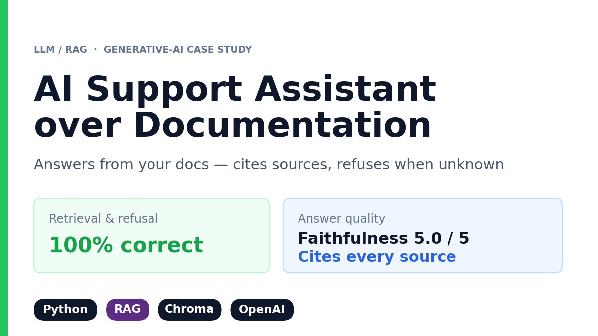

# 🤖 AI Support Assistant over Documentation (LLM / RAG)

> **In one line:** An assistant that answers customer questions straight from your own documents — always showing the source, and honestly saying "I don't know" instead of making something up.

**100% retrieval recall · 100% refusal on out-of-scope questions · Every answer cited · Built without LangChain**

---

## 🎯 The problem (in plain words)

Support teams answer the **same questions over and over** — "How long is the free trial?", "How do I add a teammate?" — while the answers are already written down in the company's documentation. Every repeat question costs an agent **paid minutes** of digging through files, and the customer waits.

Plugging in a normal AI chatbot only moves the problem: it will **invent** an answer that sounds right. In support, a confident wrong answer is worse than no answer at all.

---

## 💡 What I built

I built an assistant that **reads your own documentation and answers only from it**. It replies in seconds, shows exactly which document the answer came from, and when the answer simply isn't there, it says so instead of guessing.

- **Grounded in your files.** Drop in your documents, rebuild the index, and it's ready — no code changes, and it never answers from anything else.
- **Every answer is traceable.** The source document is shown with the answer, so anyone can verify it in one click.
- **Honest by design.** Out-of-scope questions get a plain "I don't have information about that" — no invented facts reaching your customers.
- **Cheap to run.** The text understanding happens locally for free; the paid AI is used only for the final sentence, keeping the cost per question near zero.

🔧 Under the hood (for technical readers)

- **Retrieval-Augmented Generation (RAG)** implemented from scratch in plain Python — deliberately **no LangChain**, for stability, transparency and fewer dependencies.
- **Chunking:** one chunk per document section (`##` heading), so a single fact is never split across chunks or diluted by unrelated topics. This alone cut the distance to the correct chunk from **0.63 → 0.42** and moved it from rank 4 to **rank 1**.
- **Embeddings:** local `all-MiniLM-L6-v2` (sentence-transformers), stored in a **Chroma** vector database with the source file kept per chunk. The index rebuilds from scratch, so doc edits are always reflected.
- **Generation:** `gpt-4o-mini` answers strictly from the retrieved context, with a fixed refusal string when the answer isn't present.
- **Citations:** sources are filtered by a **similarity threshold**, so only genuinely relevant documents are cited — not every retrieved chunk.
- **Evaluation:** Recall@k, refusal accuracy, and faithfulness / answer relevancy via an LLM judge — all computed in transparent Python. Unit tests with pytest.

---

## 📈 The impact

| What you get | Result |
|---|---|
| Speed | **Seconds instead of minutes** of an agent searching the docs |
| Accuracy | **100% retrieval recall** — the right document is found for every answerable question |
| Trust | Every answer arrives **with the source document** attached |
| Safety | **100% refusal** on out-of-scope questions — no invented answers (faithfulness **5.00 / 5**) |
| Easy to plug in | Swap in your own `.md` / `.txt` files and rebuild — no code changes |

**Bottom line:** questions that used to eat paid support minutes are now answered instantly from the documentation your team already wrote — with a source attached, and an honest "I don't know" whenever the answer isn't there.

---

## 🖥 Demo & visuals

**A question covered by the docs — answered, with the source shown:**

**A question outside the docs — refused instead of invented:**

---

## 🛠 Tech stack

Python · **sentence-transformers** (`all-MiniLM-L6-v2`) · **Chroma** · **OpenAI** (`gpt-4o-mini`) · Streamlit · pytest — *no LangChain*

## 📂 In this repo

- `src/ingest.py` — load documents, split by section, embed, build the vector store
- `src/rag.py` — retrieve, answer from context, cite sources, refuse when unknown
- `src/evaluate.py` — Recall@k, refusal accuracy, faithfulness & relevancy (LLM judge)
- `app.py` — Streamlit demo · `tests/` — unit tests
- Data: a sample product knowledge base of **11 documentation articles**

🔗 **Full technical implementation:** [rag-support-assistant](https://github.com/darinaze/rag-support-assistant) · ⬅️ [Back to portfolio](../README.md)

---

*Built by Daryna Zelenska — Data Scientist · Machine Learning Engineer · AI / LLM. Have documentation your team keeps re-explaining? Let's talk.*
