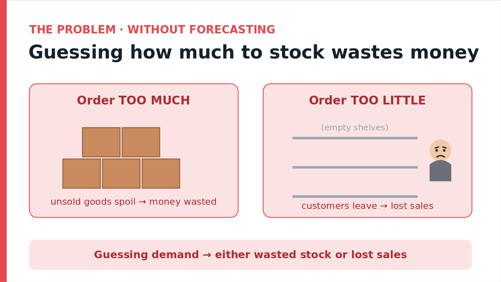
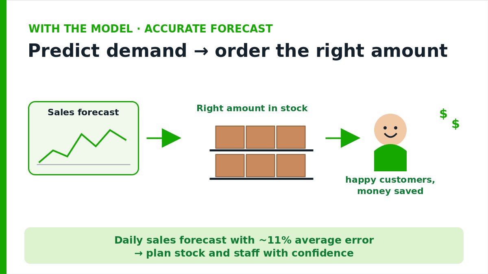
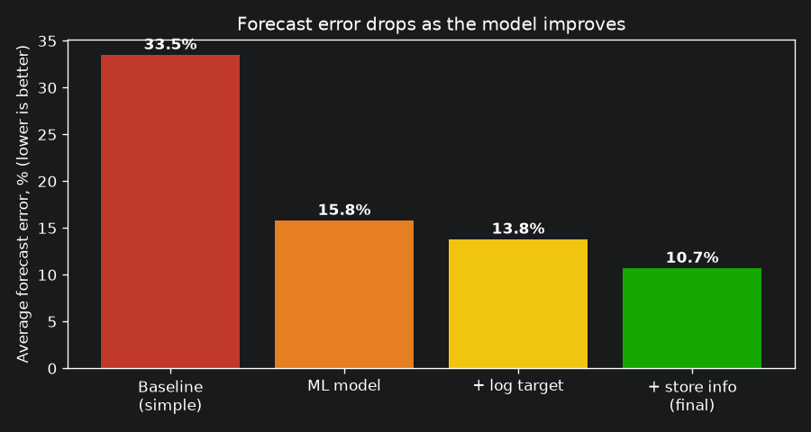

# 📈 Sales & Demand Forecasting (Time Series)

> **In one line:** A machine learning model that predicts daily sales for 1,115 stores — so the business orders the right amount of stock and plans staff, instead of guessing.

**~11% average error (MAPE 10.7%) · 1,115 stores · 3× better than a baseline**

🔗 **Full code & technical README:** [rossmann-sales-forecasting](https://github.com/darinaze/rossmann-sales-forecasting)

---

## 🎯 The problem (in plain words)

A retail chain has to decide, for every store, **how much stock to order**. Get it wrong and it costs money both ways:

- **Order too much** → unsold goods spoil or tie up cash.
- **Order too little** → empty shelves, and customers leave without buying.

Without a reliable forecast, ordering is guesswork.

---

## 💡 What I built

I built a model that predicts **each store's daily sales** for the coming weeks, so the team can plan stock and staffing with confidence.

- **Learns the real patterns** — weekly rhythm (busy Mondays, quiet Saturdays), the December peak, and how promotions lift sales.
- **Personalised per store** — it learns each store's own sales level and how strongly *that* store reacts to promotions (they differ a lot).
- **Tested honestly** — I held out the most recent 6 weeks the model never saw and measured the error on them (no peeking into the future).

🔧 Under the hood (for technical readers)

- Data: open **Rossmann Store Sales** dataset — ~1M daily records, 1,115 stores, 2.5 years.
- Full EDA; discovered and verified a 6-month refurbishment closure of 181 stores in 2014.
- Feature engineering: date parts, promotions, holidays, per-store mean sales and promo sensitivity.
- **Time-based** train/validation split; models compared from Linear Regression → Gradient Boosting → log-target → + store features.
- Final model: `HistGradientBoostingRegressor` on a log-transformed target.

---

## 📈 The impact

| Metric | Result |
|---|---|
| Average forecast error (MAPE) | **10.7%** |
| vs simple baseline (33.5%) | **~3× more accurate** |
| Average miss per store-day (MAE) | ~700 sales units |
| Scale | 1,115 stores, tested on unseen 6 weeks |

**How the error dropped as the model improved:**

**At network level, the forecast tracks actual sales almost exactly:**

**Bottom line:** accurate daily forecasts mean **fewer wasted orders, fewer empty shelves, and smarter staffing** — the forecast feeds directly into inventory and workforce decisions.

---

## 🛠 Tech stack

Python · pandas · scikit-learn (Gradient Boosting) · matplotlib · seaborn · time-series validation

🔗 **Full code, notebooks & technical details:** [github.com/darinaze/rossmann-sales-forecasting](https://github.com/darinaze/rossmann-sales-forecasting) · ⬅️ [Back to portfolio](../README.md)

---

*Built by Daryna Zelenska — Data Scientist · Machine Learning Engineer. Need demand or sales forecasting for your business? Let's talk.*
